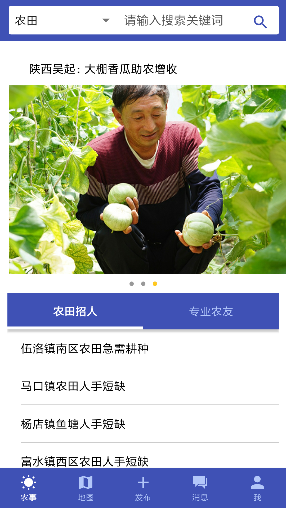
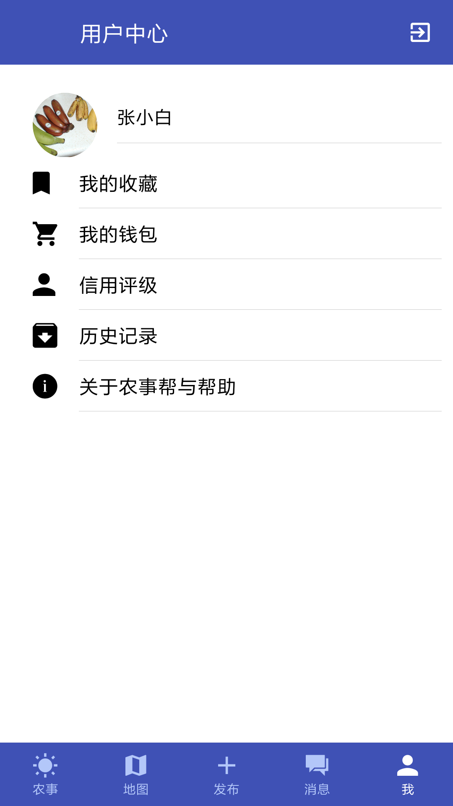
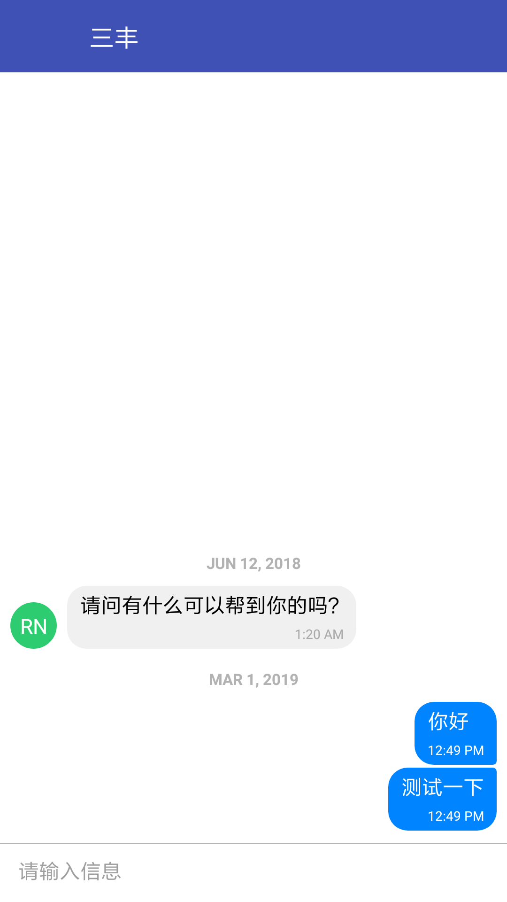

> 农事帮APP



基于React Native，可兼容Android/iOS环境。

已完成功能包括：

* 公告轮播
* 私信
* 地图定位
* 发布农事/农机信息

## 运行

### 二进制安装包

下载Release中打包好的安装包，安装即可。

### 从源码编译

```
git clone https://github.com/LuckyKoala/FarmerHelper //clone 整个项目
npm install //安装依赖
cd android
./gradlew assembleRelease //构建APK
```
